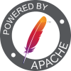

# Programacion III

Este repositorio contiene todos los ejercicios hechos a lo largo de la cursada de programacion III.

## Lenguajes

Los lenguajes tratados fueron:

* <strong>PHP</strong>
* SQL

## Temas vistos

* Archivos
* Subida de archivos a un servidor
* Base de datos
* PDO
* REST
* SLIM
* Middleware

## IDE, Frameworks y programas utilizados

<table>
    <tbody>
        <tr>
            <td></td>
            <td><a href="https://code.visualstudio.com/">Visual Studio Code</a></td>
        <tr>
        <tr>
            <td></td>
            <td><a href="https://www.apachefriends.org/es/index.html">Xampp</a></td>
        <tr>
        <tr>
            <td></td>
            <td><a href="https://www.apache.org/">Apache</a></td>
        <tr>
        <tr>
            <td></td>
            <td><a href="https://www.phpmyadmin.net/">phpMyAdmin</a></td>
        <tr>
        <tr>
            <td></td>
            <td><a href="https://getcomposer.org/">Composer</a></td>
        <tr>
        <tr>
            <td></td>
            <td><a href="https://www.slimframework.com/">Slim</a></td>
        <tr>
        <tr>
            <td></td>
            <td><a href="https://jwt.io/">JSON Web Token</a></td>
        <tr>
    </tbody>
</table>

## Autor

* Fernando Lareu - [1caruxx](https://github.com/1caruxx)

# License

This project is licensed under the GNU General Public License v3.0 - see the LICENSE.md file for details